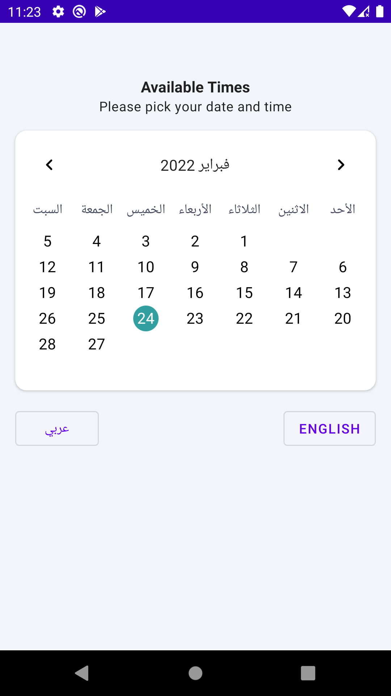
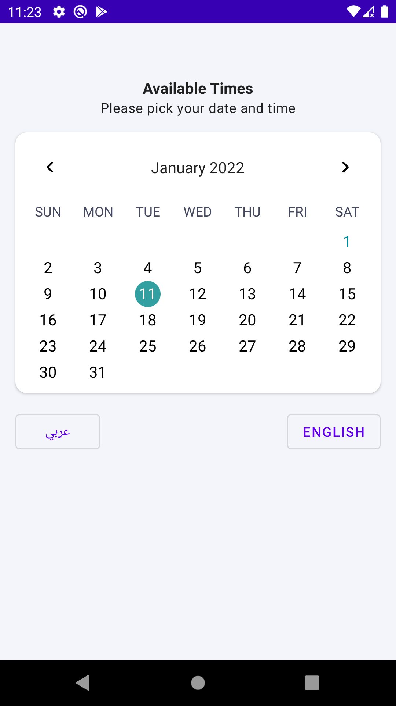
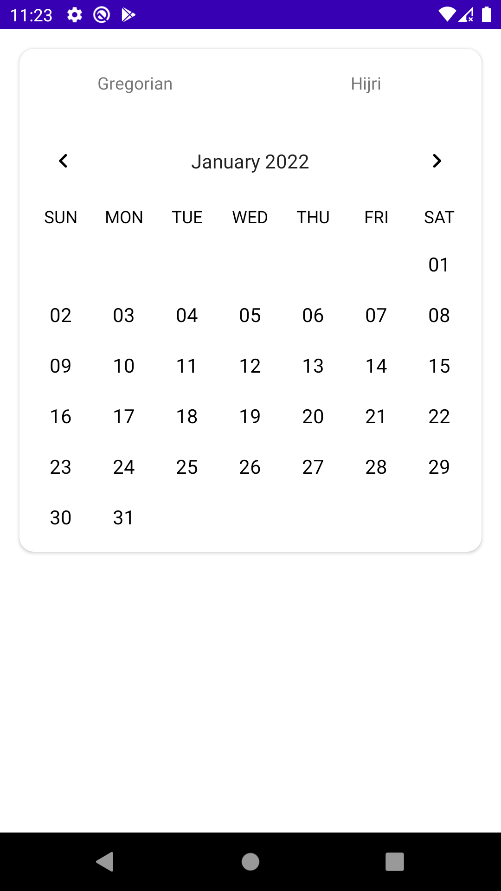
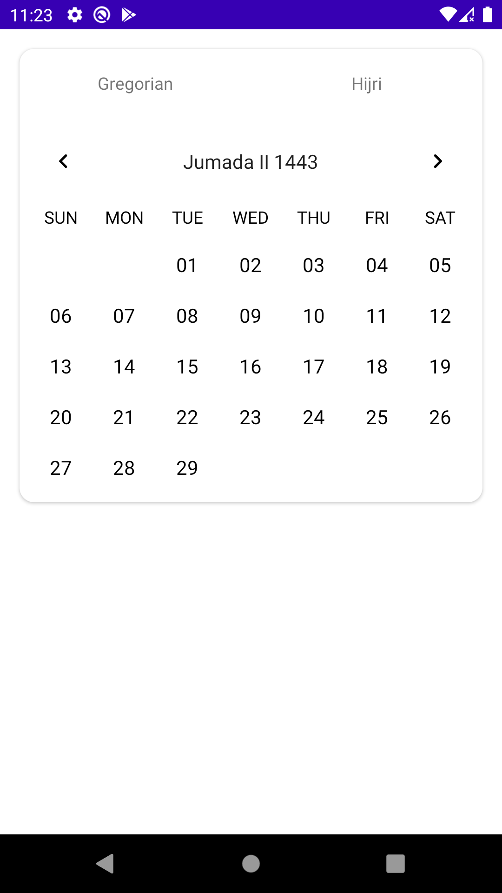

# KCalendar-View
Modern calendar view supporting both Hijri and Gregorian calendars but in highly dynamic way

[](https://www.linkedin.com/in/ahmed-ibrahim-as12)
[](https://opensource.org/licenses/MIT)
[](https://jitpack.io/#kizitonwose/CalendarView)

## Features

* Supporting multi locale mainly [EN, AR] 
* Supporting both [Hijri, Gregorian] calendars
* Java time used in dates conversion
* Day view binder
* Month view binder
* 100% Kotlin

## Getting Started

### Instillation 

Add the JitPack repository to your project level `build.gradle`:

```groovy
allprojects {
 repositories {
    google()
    jcenter()
    maven { url "https://jitpack.io" }
 }
}
```

Add CalendarView to your app `build.gradle`:

```groovy
dependencies {
	implementation 'com.github.nLoops:KCalendar-View:<latest-version>'
}
```

### How to use it

#### Step One

Adding view to XML with starter attrs

```xml
        <com.thebluekernel.calendar.library.data.ui.monthlist.KCalendarView
            android:id="@+id/calendarView"
            android:layout_width="match_parent"
            android:layout_height="match_parent"
            app:cal_WeekTextStyle="@style/Widget.Calendar.Week.Text"
            app:cal_calendarMaxYear="2022"
            app:cal_calendarMinYear="2021"
            app:cal_calendarStartOfWeek="sunday"
            app:cal_calendarType="gregorian"
            app:cal_dayViewRes="@layout/item_day_layout"
            app:cal_locale="en"
            app:cal_monthViewRes="@layout/item_month_res_layout"
            app:cal_scrollDirection="horizontal" />
```

Define your item cell xml 

```xml
    <TextView
        android:id="@+id/dayTextView"
        android:layout_width="wrap_content"
        android:layout_height="wrap_content"
        android:layout_gravity="center"
        android:gravity="center"
        android:includeFontPadding="false"
        android:padding="4dp"
        android:textAlignment="center"
        android:textAppearance="@style/TextAppearance.MaterialComponents.Subtitle1"
        tools:text="22" />
```

Define your month header xml

```xml
    <TextView
        android:id="@+id/tvMonthName"
        android:layout_width="0dp"
        android:layout_height="0dp"
        android:gravity="center"
        android:textAlignment="center"
        android:textAppearance="@style/TextAppearance.MaterialComponents.Subtitle1"
        app:layout_constraintBottom_toBottomOf="parent"
        app:layout_constraintEnd_toStartOf="@id/btnArrowNext"
        app:layout_constraintStart_toEndOf="@id/btnArrowPrev"
        app:layout_constraintTop_toTopOf="parent"
        tools:text="Nov 2019" />
```

#### Step Two

Conform binders contract for both Day and Month 

```kotlin
        val dayBinder = object : CalendarDayBinder<DayViewContainer> {
            override fun create(view: View) = DayViewContainer(view)

            override fun bind(holder: DayViewContainer, day: CalendarDay) {
              // handle your logic here
            }

        }
```

```kotlin
        val monthBinder = object : CalendarMonthBinder<MonthViewContainer> {
            override fun create(view: View) = MonthViewContainer(view)

            override fun bind(holder: MonthViewContainer, month: CalendarMonth) {
              // handle month logic here
            }

        }
```

```kotlin
  // assign binders to calendar view
  calendarView.dayBinder = dayBinder
  calendarView.monthBinder = monthBinder
```

You can refer to demo projcet examples for practical usage.

## Screenshots
<table>
<caption>Demo app screenshots</caption>
  <tr>
    <td></td>
    <td></td>
  </tr>
  <tr>
    <td></td>
    <td></td>
  </tr>
</table>

## TODO

* Range date selection.
* Week row.
* Multi-date selection.
* Async setup for better performance especially into big range of dates.


## Contribution

Feel free to fork project and do your changes, but don't forget to leave a start *_*
